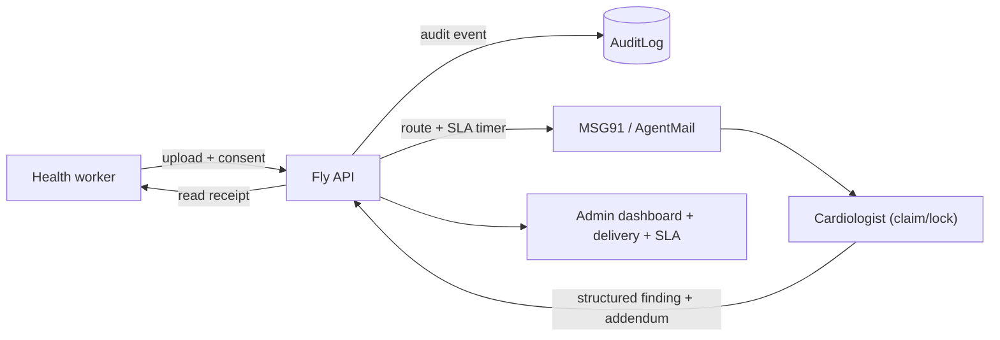

# HridLink Feature Roadmap

Phased build across all 4 tiers. Each phase is independently shippable. Stack is fixed: Next.js 14 App Router front-end (`app/`) proxying via [lib/server-data.ts](../lib/server-data.ts) to the Fly Express API ([api-fly/src/index.ts](../api-fly/src/index.ts)), Prisma + Neon Postgres ([prisma/schema.prisma](../prisma/schema.prisma)), MSG91 WhatsApp + AgentMail ([api-fly/src/lib/notify.ts](../api-fly/src/lib/notify.ts)).

## Why this order

The current loop works, but several headline claims in [docs/YC-NARRATIVE.md](../docs/YC-NARRATIVE.md) are not yet real in code: audit trail, response-time SLA, DPDP consent, and the labeled-data moat. Phase 1 makes the pitch true; later phases add depth and the network foundation.

## Progress checklist

- [ ] **p1-audit** - Phase 1: AuditLog model + logAudit helper wired into all mutating Fly routes + timeline endpoint/UI
- [ ] **p1-sla** - Phase 1: SLA fields + internal sla-sweep endpoint + Fly cron + overdue badges
- [ ] **p1-consent** - Phase 1: Patient consent fields + validator + registration UI checkbox/blurb
- [ ] **p1-claim** - Phase 1: claim/release endpoints + claim fields + cardiologist queue lock indicator
- [ ] **p2-structured** - Phase 2: structured finding fields (heartRate, rhythm, abnormalities) in schema/validator/UI
- [ ] **p2-history** - Phase 2: per-patient ECG history endpoint + cardiologist context timeline
- [ ] **p2-addendum** - Phase 2: append-only FindingAddendum model + endpoint + readback rendering
- [ ] **p2-multiimage** - Phase 2: EcgAttachment model + backfill migration + multi-image upload/viewer
- [ ] **p3-offline** - Phase 3: offline upload queue via PWA + IndexedDB replay
- [ ] **p3-notiflog** - Phase 3: NotificationLog + MSG91 message IDs/status + delivery rate on admin
- [ ] **p3-ack** - Phase 3: read-receipt acknowledgedAt + acknowledge endpoint + My ECGs action
- [ ] **p3-i18n** - Phase 3: Hindi/Telugu localization scaffolding for health-worker pages
- [ ] **p4-routing** - Phase 4: multi-cardiologist roster + on-call DB-driven routing
- [ ] **p4-tenant** - Phase 4: Clinic/Org multi-tenant model + scoped dashboards + per-district CSV

## Phase 1 - Make the YC pitch true (Tier 1)

### 1a. Audit trail / case timeline
- Schema: add `AuditLog { id, actorUserId?, action, entityType, entityId, metadata Json?, createdAt }` to [prisma/schema.prisma](../prisma/schema.prisma); index `(entityType, entityId)`.
- API: a `logAudit()` helper in a new `api-fly/src/lib/audit.ts`; call it from every mutating route in [api-fly/src/index.ts](../api-fly/src/index.ts) (upload, finding-submit, role-change, claim, signed-url view).
- API: `GET /api/ecg/:id/timeline` (CARDIOLOGIST/ADMIN) returning ordered events.
- UI: timeline panel on the cardiologist case view and admin record drawer.

### 1b. SLA timers + escalation
- Schema: add `lastNotifiedAt`, `escalatedAt` to `ECGRecord`.
- API: new `POST /api/internal/sla-sweep` (secured by existing `X-Internal-Secret`) that finds `PENDING` records older than `SLA_MINUTES`, re-pings via `sendToCardiologist`, sets `escalatedAt`, writes an audit event.
- Schedule: Fly cron / scheduled machine hitting the sweep endpoint every ~5 min (documented in a new `docs/SLA-ESCALATION.md`).
- UI: "overdue" badge in the cardiologist queue and admin dashboard; surface count.

### 1c. Patient consent capture
- Schema: add `consentGivenAt DateTime?`, `consentVersion String?` to `Patient`.
- Validator: extend `createPatientSchema` in [api-fly/src/lib/validators.ts](../api-fly/src/lib/validators.ts) with `consentGiven: z.literal(true)` + version.
- UI: consent checkbox + short DPDP blurb on the patient registration form ([app/(public)/register/page.tsx](<../app/(public)/register/page.tsx>)); ticks the unchecked box in [docs/PILOT-OPERATING-LOG.md](../docs/PILOT-OPERATING-LOG.md).

### 1d. Case claim / lock
- Schema: add `claimedById String?`, `claimedAt DateTime?` to `ECGRecord`.
- API: `POST /api/ecg/:id/claim` and `/release` (CARDIOLOGIST); finding-submit auto-claims if unclaimed. Surface `claimedBy` in `GET /api/ecg` list select.
- UI: "Dr. X reviewing" indicator + Claim button in [app/(protected)/cardiologist/cardiologist-queue.tsx](<../app/(protected)/cardiologist/cardiologist-queue.tsx>).

## Phase 2 - Clinical depth + data moat (Tier 2)

### 2a. Structured finding fields
- Schema: add nullable `heartRateBpm Int?`, `rhythm String?`, `abnormalities String[]` to `Finding` (keep free-text fields).
- Validator: extend `submitFindingSchema`; UI adds rhythm select + abnormality multi-select in the finding form. This is what turns reviewed ECGs into a real labeled corpus.

### 2b. Per-patient ECG history
- API: `GET /api/patients/:id/ecgs` (staff) returning prior records + findings.
- UI: prior-ECG timeline on the cardiologist review screen so reviews have context.

### 2c. Finding addendum (append-only)
- Schema: new `FindingAddendum { id, findingId, authorUserId?, note, createdAt }` (preserve write-once `Finding` + audit integrity).
- API: `POST /api/ecg/:id/finding/addendum`; render addenda in `my-ecgs` and admin views.

### 2d. Multi-image ECG
- Schema: new `EcgAttachment { id, ecgRecordId, storagePath, mimeType, createdAt }`; migrate existing single `fileUrl`/`storagePath` into one attachment row (backfill migration).
- API: `POST /api/ecg/:id/attachments`; viewer + upload UI handle multiple pages.

## Phase 3 - Field reliability and reach (Tier 3)

### 3a. Offline upload queue
- Leverage existing `@ducanh2912/next-pwa`; queue captures in IndexedDB and replay POST `/api/ecg` on reconnect with a "pending sync" state in [app/(public)/ecg-upload/page.tsx](<../app/(public)/ecg-upload/page.tsx>).

### 3b. Notification delivery tracking
- Schema: new `NotificationLog { id, ecgRecordId?, channel, recipient, providerMessageId?, status, createdAt }`.
- API: capture MSG91 message IDs in [api-fly/src/lib/notify.ts](../api-fly/src/lib/notify.ts); optional MSG91 webhook to update status. Show real delivery rate on admin dashboard (replaces manual spot-check in [docs/PILOT-OPERATING-LOG.md](../docs/PILOT-OPERATING-LOG.md)).

### 3c. Read receipt / acknowledgement
- Schema: add `acknowledgedAt DateTime?` to `ECGRecord`.
- API: `POST /api/ecg/:id/acknowledge` (uploader); UI "Mark as read/actioned" in [app/(protected)/my-ecgs/page.tsx](<../app/(protected)/my-ecgs/page.tsx>). Makes loop-closure provable.

### 3d. Localization (Hindi/Telugu)
- Add lightweight i18n (dictionary + locale switch); extract strings for the health-worker-facing pages first.

## Phase 4 - Network / ops foundations (Tier 4)

### 4a. Multi-cardiologist routing + on-call
- Schema: `OnCallSchedule` / cardiologist roster; replace single `MSG91_CARDIOLOGIST_PHONE` env with DB-driven routing (round-robin or on-call window). Foundation for the Phase-2 marketplace in the narrative.

### 4b. District/clinic multi-tenant
- Schema: new `Clinic`/`Org` entity; relate `User` and `Patient`; scope dashboards and add per-district CSV. Enables per-district SaaS billing.

## Sequencing notes
- Each phase ends with one Prisma migration (`npm run db:migrate`) and a beta re-seed check (`npm run db:seed-beta`).
- Add Playwright coverage per phase under `tests/e2e` (consent, claim, addendum, acknowledge) per the project's playwright-e2e skill.
- Keep AI/triage automation out of scope until structured-finding volume (2a) accumulates - consistent with the narrative's "do not lead with AI diagnosis."
